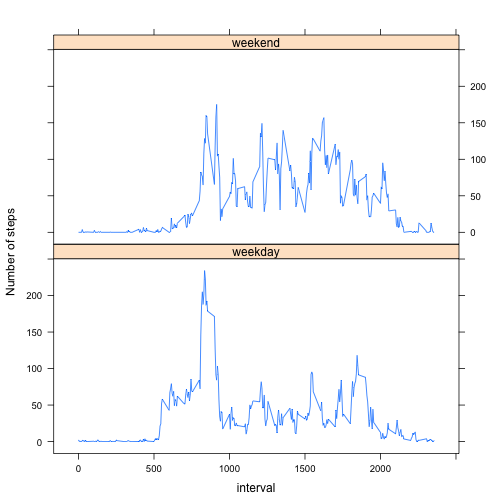

# Reproducible Research: Peer Assessment 1


## Loading and preprocessing the data

This assignment makes use of data from a personal activity monitoring
device. This device collects data at 5 minute intervals through out the
day. The data consists of two months of data from an anonymous
individual collected during the months of October and November, 2012
and include the number of steps taken in 5 minute intervals each day.

The data is found in `activity.zip`, which we need to unzip.


```r
dataArchiveFile <- "activity.zip"
dataFile <- "activity.csv"
if (!file.exists(dataFile)) {
    if (!file.exists(dataArchiveFile)) {
        stop("input archive file ", dataArchiveFile, " not found")
    }
    unzip(dataArchiveFile)
}
```


Then we can read the CSV file into a data frame.


```r
data <- read.csv(dataFile)
str(data)
```

```
## 'data.frame':	17568 obs. of  3 variables:
##  $ steps   : int  NA NA NA NA NA NA NA NA NA NA ...
##  $ date    : Factor w/ 61 levels "2012-10-01","2012-10-02",..: 1 1 1 1 1 1 1 1 1 1 ...
##  $ interval: int  0 5 10 15 20 25 30 35 40 45 ...
```


## What is mean total number of steps taken per day?

For this part of the assignment, we will ignore the missing values in
the steps column of the dataset.

### Histogram of the total number of steps taken each day

The data frame has one record per five minute interval,
so we first need to aggregate those into one record per day.


```r
stepsPerDay <- tapply(data$steps, data$date, sum)
hist(stepsPerDay, main = "Number of steps per day", xlab = "Steps")
```

 


## Mean and median total number of steps taken per day

Mean and percentiles (including the 50th percentile, the median) are easily
obtained by calling `summary`.


```r
summary(stepsPerDay, digits = 10)
```

```
##    Min. 1st Qu.  Median    Mean 3rd Qu.    Max.    NA's 
##      41    8841   10765   10766   13294   21194       8
```


## What is the average daily activity pattern?


### Time series plot of the average number of steps during the day

We aggregate again, but this time not per day, but per 5-minute interval, to arrive at
the average number of steps taken during that particular interval of every day.
This calculation only works when we remove the missing values first.


```r
stepsPerInterval <- aggregate(data$steps, list(data$interval), mean, na.rm = TRUE)
colnames(stepsPerInterval) <- c("interval", "steps")
```


These averages can then be used to make a time series plot:


```r
plot(stepsPerInterval$interval, stepsPerInterval$steps, type = "l", ylab = "Steps", 
    xlab = "Time of day")
```

 


### Most active interval

Now we can determine, which 5-minute interval, on average across all the days in the dataset, contains the maximum number of steps:


```r
stepsPerInterval[order(stepsPerInterval$steps, decreasing = TRUE)[1], ]
```

```
##     interval steps
## 104      835 206.2
```


## Imputing missing values

Note that there are a number of days/intervals where there are missing
values (coded as `NA`). The presence of missing days may introduce
bias into some calculations or summaries of the data.

We will devise a strategy for filling in all of the missing values in the dataset
and determine the result of this on our calculations.

### Number of missing values in the dataset


```r
nrow(data) - sum(complete.cases(data))
```

```
## [1] 2304
```


### Strategy for filling in the missing values in the dataset

Our strategy to fill in these missing values is extremely simple:
We just plug in the median value for the average for that 5-minute interval
from the other days (a value that is conveniently already available
thanks to our previous calculations).

### Create a new dataset with the missing data filled in

First, we merge the original dataset with our `stepsPerInterval` averages
on the `interval` column. This creates a new fourth column with the average
step counts for every interval.


```r
imputedData <- merge(data, stepsPerInterval, by = ("interval"))
head(imputedData)
```

```
##   interval steps.x       date steps.y
## 1        0      NA 2012-10-01   1.717
## 2        0       0 2012-11-23   1.717
## 3        0       0 2012-10-28   1.717
## 4        0       0 2012-11-06   1.717
## 5        0       0 2012-11-24   1.717
## 6        0       0 2012-11-15   1.717
```


Then we build our derived dataset by taking the step count from with
the original column (if present) or from the averages (if not).


```r
missing <- is.na(imputedData$steps.x)
imputedData[missing, "steps.x"] <- imputedData$steps.y[missing]
head(imputedData)
```

```
##   interval steps.x       date steps.y
## 1        0   1.717 2012-10-01   1.717
## 2        0   0.000 2012-11-23   1.717
## 3        0   0.000 2012-10-28   1.717
## 4        0   0.000 2012-11-06   1.717
## 5        0   0.000 2012-11-24   1.717
## 6        0   0.000 2012-11-15   1.717
```


### Histogram, mean and median for derived data


```r
imputedStepsPerDay <- tapply(imputedData$steps.x, imputedData$date, sum)
hist(imputedStepsPerDay, main = "Number of steps per day", xlab = "Steps")
```

 

```r
summary(stepsPerDay, digits = 10)
```

```
##    Min. 1st Qu.  Median    Mean 3rd Qu.    Max.    NA's 
##      41    8841   10765   10766   13294   21194       8
```

```r
summary(imputedStepsPerDay, digits = 10)
```

```
##    Min. 1st Qu.  Median    Mean 3rd Qu.    Max. 
##      41    9819   10766   10766   12811   21194
```


As we can see, imputing missing data has

* not changed the daily averages ("Mean")
* but it has changed the quantiles, including median


## Are there differences in activity patterns between weekdays and weekends?

We are going back to the original dataset for the following analysis,
in particular because any differences between weekdays and weekend would
have been smoothened a bit by our simplistic imputation strategy.

### Adding a new factor: weekday / weekend

To use data/time calculations, we need to parse the `date` into proper
Date objects:


```r
derivedData <- cbind(data)
derivedData[, "date"] <- as.Date(data$date)
```


We can then add a weekday column and a weekend factor.

We use `strftime` instead of the `weekdays` function to [avoid locale issues](https://github.com/rdpeng/RepData_PeerAssessment1/issues/3).
It returns a number from 0 (Sunday) to 6 (Saturday), so that the weekend is 0 and 6.


```r
derivedData[, "weekday"] <- strftime(derivedData$date, "%w")
derivedData[, "weekend"] <- derivedData$weekday == 6 | derivedData$weekday == 
    0
derivedData[, "weekend"] <- factor(derivedData$weekend, labels = c("weekday", 
    "weekend"))
```


### Panel plot weekdays vs weekend

With this new factor, we can calculate two different step count averages for each interval,
one for the weekend, and one for the weekdays, and plot them using `xyplot` from the `lattice` package.


```r
stepsPerInterval <- with(derivedData, aggregate(steps, list(weekend, interval), 
    mean, na.rm = TRUE))
colnames(stepsPerInterval) <- c("weekend", "interval", "steps")
head(stepsPerInterval)
```

```
##   weekend interval  steps
## 1 weekday        0 2.3333
## 2 weekend        0 0.0000
## 3 weekday        5 0.4615
## 4 weekend        5 0.0000
## 5 weekday       10 0.1795
## 6 weekend       10 0.0000
```

```r
library("lattice")
with(stepsPerInterval, xyplot(steps ~ interval | weekend, type = "l", ylab = "Number of steps", 
    layout = c(1, 2)))
```

 


Apparently, people sleep longer on weekends: fewer steps before 7 am.

